# Execution Plan

## Detailed Analysis Summary

### Change Impact Assessment
- **User-facing changes**: Yes - 고객 주문 UI, 관리자 대시보드 전체 신규 개발
- **Structural changes**: Yes - 프론트엔드(React) + 백엔드(Spring Boot) + DB(PostgreSQL) 신규 아키텍처
- **Data model changes**: Yes - Store, Table, MenuItem, Order 등 전체 데이터 모델 신규 설계
- **API changes**: Yes - REST API 전체 신규 설계 + SSE 엔드포인트
- **NFR impact**: Yes - 실시간 통신(SSE), JWT 인증, 멀티테넌트 데이터 격리, 보안 규칙 적용

### Risk Assessment
- **Risk Level**: Medium
- **Rollback Complexity**: Easy (신규 프로젝트이므로 롤백 불필요)
- **Testing Complexity**: Moderate (SSE 실시간 통신, 멀티테넌트 격리 테스트 필요)

---

## Workflow Visualization

```mermaid
flowchart TD
    Start(["User Request"])

    subgraph INCEPTION["INCEPTION PHASE"]
        WD["Workspace Detection<br/><b>COMPLETED</b>"]
        RA["Requirements Analysis<br/><b>COMPLETED</b>"]
        US["User Stories<br/><b>COMPLETED</b>"]
        WP["Workflow Planning<br/><b>COMPLETED</b>"]
        AD["Application Design<br/><b>EXECUTE</b>"]
        UG["Units Generation<br/><b>EXECUTE</b>"]
    end

    subgraph CONSTRUCTION["CONSTRUCTION PHASE"]
        FD["Functional Design<br/><b>EXECUTE</b>"]
        NFRA["NFR Requirements<br/><b>EXECUTE</b>"]
        NFRD["NFR Design<br/><b>EXECUTE</b>"]
        ID["Infrastructure Design<br/><b>EXECUTE</b>"]
        CG["Code Generation<br/><b>EXECUTE</b>"]
        BT["Build and Test<br/><b>EXECUTE</b>"]
    end

    subgraph OPERATIONS["OPERATIONS PHASE"]
        OPS["Operations<br/><b>PLACEHOLDER</b>"]
    end

    Start --> WD
    WD --> RA
    RA --> US
    US --> WP
    WP --> AD
    AD --> UG
    UG --> FD
    FD --> NFRA
    NFRA --> NFRD
    NFRD --> ID
    ID --> CG
    CG --> BT
    BT --> OPS
    OPS --> End(["Complete"])

    style WD fill:#4CAF50,stroke:#1B5E20,stroke-width:3px,color:#fff
    style RA fill:#4CAF50,stroke:#1B5E20,stroke-width:3px,color:#fff
    style US fill:#4CAF50,stroke:#1B5E20,stroke-width:3px,color:#fff
    style WP fill:#4CAF50,stroke:#1B5E20,stroke-width:3px,color:#fff
    style AD fill:#FFA726,stroke:#E65100,stroke-width:3px,stroke-dasharray: 5 5,color:#000
    style UG fill:#FFA726,stroke:#E65100,stroke-width:3px,stroke-dasharray: 5 5,color:#000
    style FD fill:#FFA726,stroke:#E65100,stroke-width:3px,stroke-dasharray: 5 5,color:#000
    style NFRA fill:#FFA726,stroke:#E65100,stroke-width:3px,stroke-dasharray: 5 5,color:#000
    style NFRD fill:#FFA726,stroke:#E65100,stroke-width:3px,stroke-dasharray: 5 5,color:#000
    style ID fill:#FFA726,stroke:#E65100,stroke-width:3px,stroke-dasharray: 5 5,color:#000
    style CG fill:#4CAF50,stroke:#1B5E20,stroke-width:3px,color:#fff
    style BT fill:#4CAF50,stroke:#1B5E20,stroke-width:3px,color:#fff
    style OPS fill:#BDBDBD,stroke:#424242,stroke-width:2px,stroke-dasharray: 5 5,color:#000
    style Start fill:#CE93D8,stroke:#6A1B9A,stroke-width:3px,color:#000
    style End fill:#CE93D8,stroke:#6A1B9A,stroke-width:3px,color:#000
```



### Text Alternative
```
INCEPTION PHASE:
  1. Workspace Detection     (COMPLETED)
  2. Requirements Analysis   (COMPLETED)
  3. User Stories             (COMPLETED)
  4. Workflow Planning        (COMPLETED)
  5. Application Design      (EXECUTE)
  6. Units Generation        (EXECUTE)

CONSTRUCTION PHASE (per unit):
  7. Functional Design       (EXECUTE)
  8. NFR Requirements        (EXECUTE)
  9. NFR Design              (EXECUTE)
  10. Infrastructure Design  (EXECUTE)
  11. Code Generation        (EXECUTE)
  12. Build and Test         (EXECUTE)

OPERATIONS PHASE:
  13. Operations             (PLACEHOLDER)
```

---

## Phases to Execute

### INCEPTION PHASE
- [x] Workspace Detection (COMPLETED)
- [x] Requirements Analysis (COMPLETED)
- [x] User Stories (COMPLETED)
- [x] Workflow Planning (COMPLETED)
- [ ] Application Design - EXECUTE
  - **Rationale**: 신규 프로젝트로 컴포넌트 구조, API 설계, 데이터 모델 정의가 필요
- [ ] Units Generation - EXECUTE
  - **Rationale**: 프론트엔드/백엔드/DB 등 다중 컴포넌트를 작업 단위로 분해 필요

### CONSTRUCTION PHASE (per unit)
- [ ] Functional Design - EXECUTE
  - **Rationale**: 데이터 모델, 비즈니스 로직(주문 상태 전이, 세션 관리), API 설계 필요
- [ ] NFR Requirements - EXECUTE
  - **Rationale**: 보안 확장 규칙(SECURITY-01~15) 적용, SSE 성능, JWT 인증 요구사항 정의 필요
- [ ] NFR Design - EXECUTE
  - **Rationale**: NFR Requirements에서 정의된 보안/성능 패턴을 설계에 반영 필요
- [ ] Infrastructure Design - EXECUTE
  - **Rationale**: AWS 클라우드 배포 환경 설계 (ECS/Lambda, RDS, VPC 등) 필요
- [ ] Code Generation - EXECUTE (ALWAYS)
  - **Rationale**: 실제 코드 구현
- [ ] Build and Test - EXECUTE (ALWAYS)
  - **Rationale**: 빌드 및 테스트 지침 생성

### OPERATIONS PHASE
- [ ] Operations - PLACEHOLDER
  - **Rationale**: 향후 배포/모니터링 워크플로우 확장 예정

---

## Success Criteria
- **Primary Goal**: 멀티테넌트 테이블오더 MVP 서비스 구축
- **Key Deliverables**:
  - React(Vite) + TypeScript 프론트엔드 (고객용 + 관리자용)
  - Java Spring Boot 백엔드 (REST API + SSE)
  - PostgreSQL 데이터베이스 스키마
  - AWS 인프라 설계
  - 빌드/테스트 지침
- **Quality Gates**:
  - SECURITY-01~15 보안 규칙 준수
  - INVEST 기준 충족하는 사용자 스토리 기반 구현
  - SSE 실시간 통신 2초 이내 응답
